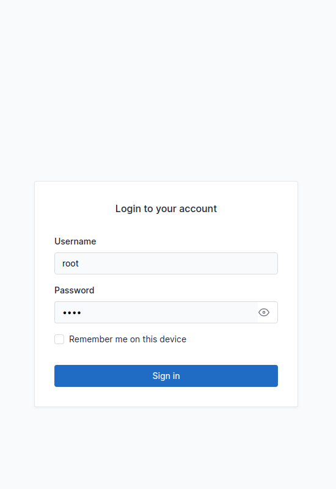
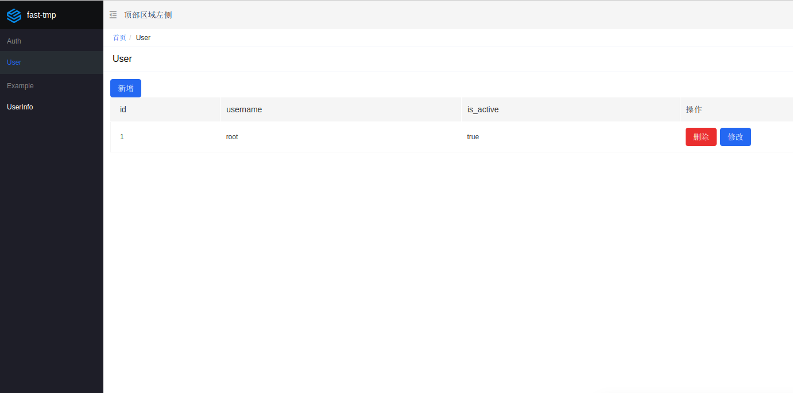
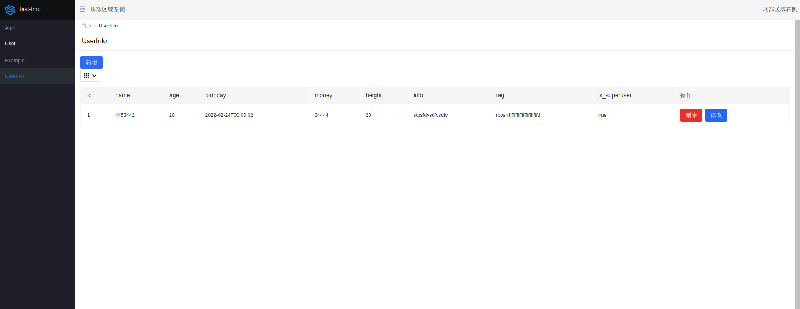
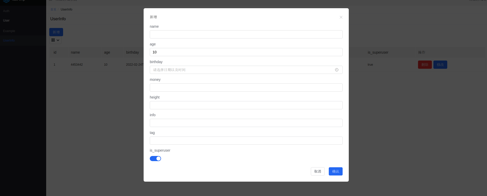

# fast-tmp

[](https://github.com/Chise1/fast-tmp/actions/workflows/test.yml)
[](https://codecov.io/gh/Chise1/fast-tmp)
[](https://fast-tmp.readthedocs.io/zh_TW/latest/?badge=latest)


# 介绍

fast-tmp项目受django-admin的影响，旨在实现一个基于sqlalchemy+fastapi+amis的通用后台管理平台。

- sqlalchemy:python最受欢迎的数据库操作工具。
- fastapi:新版本python最受欢迎的web框架之一。
- amis:一款利用json数据生成页面的前端低代码项目。

笔者前端能力比较弱，从实用主义出发，利用amis搭建后台管理的页面。这也为未来页面的功能拓展提供了无限可能。并摆脱前端开发的影响。（由于偷懒，登陆页面用的taber构建的。以后有时间了修改）

## 该项目的存在意义

fastapi是一款非常优秀的web框架，long2ice基于异步数据库访问库（tortoise-orm）构建了fastapi-admin项目，使用fastapi+tortoise-orm。
笔者新项目需要使用到sqlalchemy，也没有找到合适的库，所以决定自己动手来实现自己需要的功能。

## 页面展示






## 入门

### 安装

通过pip进行安装：

```shell
pip install fast-tmp
```

如果使用poetry,则

```shell
poetry add fast-tmp
```

## 快速教程

在项目启动的根目录先创建一个.env文件,主要内容如下：

```text
DATABASE_URL=sqlite:///example.db # 数据库
SECRET_KEY=rtbhwaergvqerg # user加密用的密码
DEBUG=False # 是否启动debug模式，debug模式会打印所有访问数据的的操作
```

如果你有这么一个model:

```python
# models.py
from sqlalchemy import String, Boolean, Integer, DateTime, DECIMAL, Float, JSON, Text, Column
from fast_tmp.models import Base


class UserInfo(Base):
    __tablename__ = "userinfo"
    id = Column(Integer, primary_key=True)
    name = Column(String(128), unique=True)
    age = Column(Integer, default=10, )
    birthday = Column(DateTime)
    money = Column(DECIMAL(scale=3))
    height = Column(Float)
    info = Column(JSON)
    tag = Column(Text)
    is_superuser = Column(Boolean(), default=True)

```

那么，你只需要构建一个页面model:

```python
# admin.py
from fast_tmp.site import ModelAdmin
from .models import UserInfo


class UserInfoAdmin(ModelAdmin):
    model = UserInfo
    create_fields = [UserInfo.name, UserInfo.age, UserInfo.birthday, UserInfo.money, UserInfo.height, UserInfo.info,
                     UserInfo.tag, UserInfo.is_superuser]
    update_fields = create_fields
    list_display = [UserInfo.id, UserInfo.name, UserInfo.age, UserInfo.birthday, UserInfo.money, UserInfo.height,
                    UserInfo.info,
                    UserInfo.tag, UserInfo.is_superuser]
```

然后进行注册：

```python
# main.py
from fast_tmp.site import register_model_site
from example.admin import UserInfoAdmin

register_model_site({"Example": [UserInfoAdmin]})  # example是页面上标签名，对应是一个列表。
```

可以把admin功能单独启动或者注册到现有项目上： 注册到项目上

```python
from fastapi import FastAPI

from fast_tmp.admin.server import admin
from fast_tmp.site import register_model_site
from example.admin import UserInfoAdmin

register_model_site({"Example": [UserInfoAdmin]})  # 注册页面
app = FastAPI()
app.mount("/admin", admin, name="admin", )  # 注册admin的app，注意暂时只能为/admin，以后会进行修改

if __name__ == '__main__':  # 调试模式启动
    import uvicorn

    uvicorn.run(app, debug=True, port=8000, lifespan="on")
```

### 创建超级用户
```shell
fast-tmp createsuperuser username password
```


### 自定义指令

在settings里面配置```EXTRA_SCRIPT```参数，就像配置django的参数一样，把脚本的相对导入路径写到这个字段列表里面，即可通过fast-tmp进行执行。

可以通过```fast-tmp --help```查看当前有哪些执行指令
