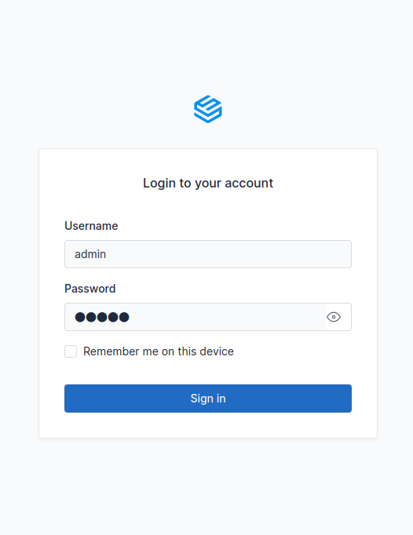
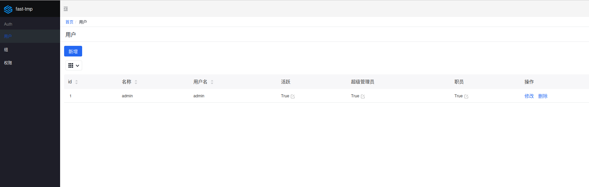
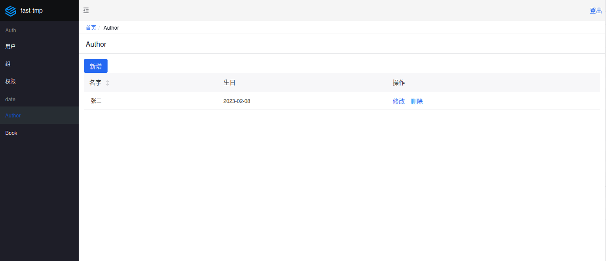
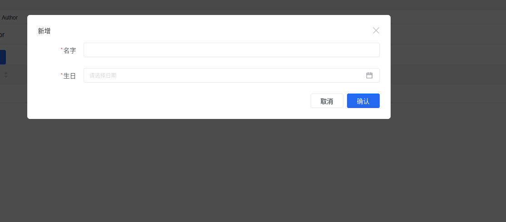
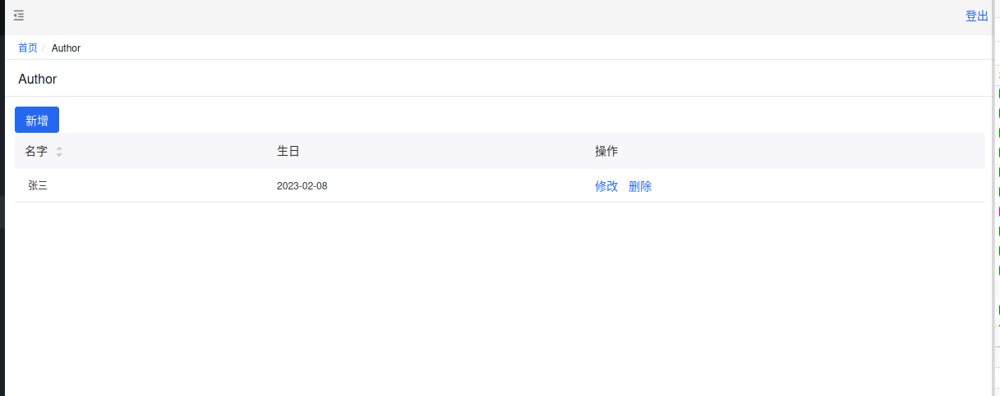
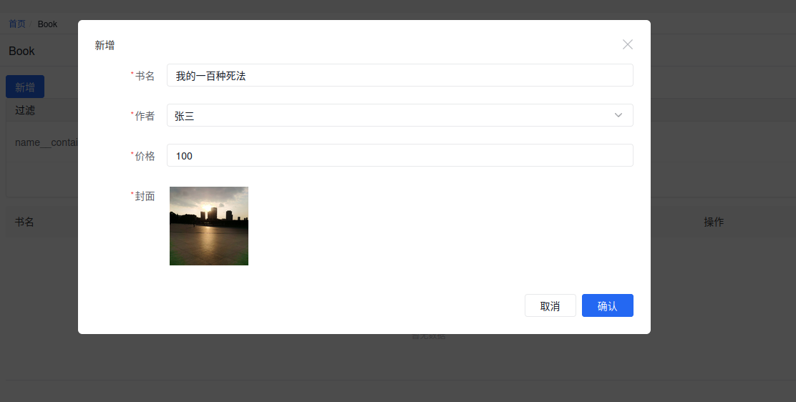
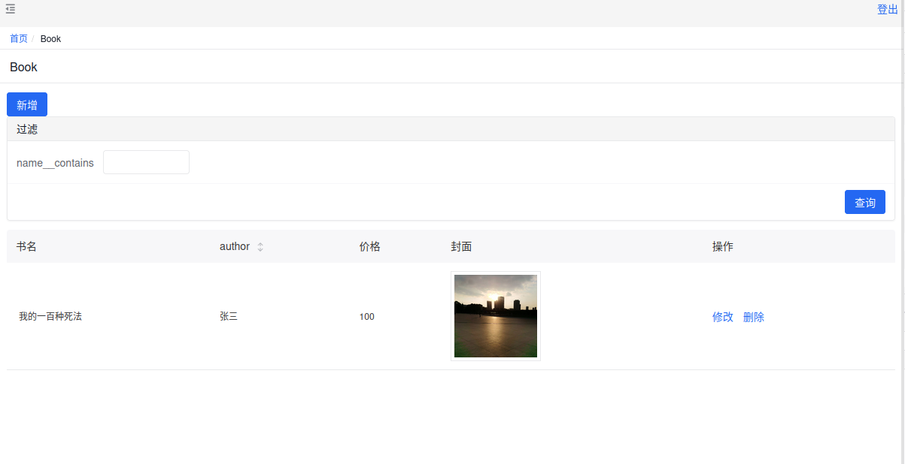
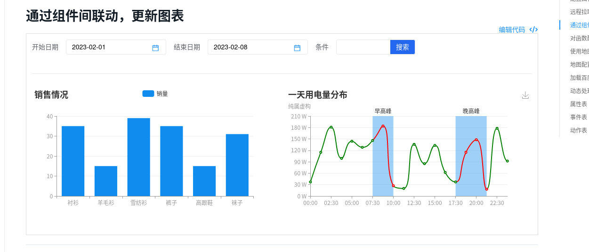
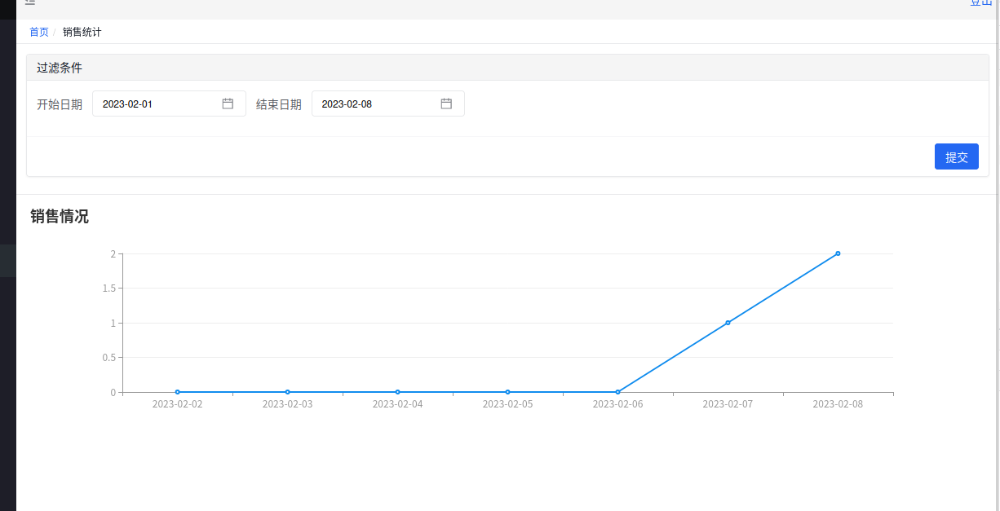

# 入门

## 创建项目

创建一个文件夹```fast-tmp-study```

```shell
mkdir fast-tmp-study
```

创建虚拟环境（以poetry为例）

```shell
poetry init
poetry install
```

修改软件源（一般情况下不用修改，现在国内用默认源挺快的）,
修改`pyproject.toml`文件，在后面加上：

```toml
[[tool.poetry.source]]
url = "https://mirrors.aliyun.com/pypi/simple/" # 如果是其他源自己改
name = "aliyun"
default = true
```

安装fast-tmp（注意，fast-tmp最低支持python3.8）

```shell
poetry add fast-tmp
```

安装`cookiecutter`，这个包只有在创建项目的时候才用上，所以用pip安装

```shell
pip3 install cookiecutter
```

通过fast-tmp创建项目模板

```shell
fast-tmp startproject
```

然后需要创建数据表，如果使用aerich则请参考aerich官网进行创建。
如果想简单点，可以修改src/app.py文件下的配置为：

```pycon
register_tortoise(app, config=settings.TORTOISE_ORM, generate_schemas=True) # generate_schemas配置为true会自动创建数据表
```

并进入src文件夹，启动一次app.py文件。（如何配置python解释器为poetry创建的解释器就不赘述了）
然后在src文件夹下执行(注意需要使用poetry的虚拟环境):

```shell
fast-tmp creatersuperuser admin admin
```

即可创建管理员。
访问http://127.0.0.1:8000/admin/login页面可登录并进入后台管理。



## 注册模型

将一个模型生成一个管理页面的标准流程：

1. 编写对应的admin类
2. 注册到admin服务上去。

### 示例

假设我们有一个author，一个book表，修改fast_tmp_example/models.py文件如下：

```python
from tortoise import fields
from tortoise.models import Model
from fast_tmp.contrib.tortoise.fields import ImageField  # fast-tmp自己的字符


class Author(Model):
    name = fields.CharField(max_length=255, description="名字")
    birthday = fields.DateField(description="生日")
    create_time = fields.DatetimeField(auto_now_add=True)
    update_time = fields.DatetimeField(auto_now=True)

    def __str__(self):
        return self.name


class Book(Model):
    name = fields.CharField(max_length=255, description="书名")
    author: fields.ForeignKeyRelation[Author] = fields.ForeignKeyField(
        "fast_tmp.Author", related_name="books", description="作者"
    )
    cover = ImageField(description="封面")
    rating = fields.FloatField(description="价格")
    quantity = fields.IntField(default=0, description="存量")
    create_time = fields.DatetimeField(auto_now_add=True)
    update_time = fields.DatetimeField(auto_now=True)

```

创建对应的admin类，修改fast_tmp_example/admin.py如下：

```python
from fast_tmp.site import ModelAdmin
from fast_tmp_example.models import Book, Author


class BookModel(ModelAdmin):
    model = Book
    list_display = ("name", "author", "rating", "cover")  # list列表显示的字段
    create_fields = ("name", "author", "rating", "cover")  # 创建页面的字段
    update_fields = ("name", "author", "cover")  # 更新字段
    filters = ("name__contains",)  # 过滤字段
    ordering = ("author",)  # 排序字段


class AuthorModel(ModelAdmin):
    model = Author
    list_display = ("name", "birthday")
    create_fields = ("name", "birthday")
    update_fields = ("name", "birthday")
    ordering = ("name",)

```

修改app.py文件，增加注册行：

```python
from tortoise.contrib.fastapi import register_tortoise
from fast_tmp.conf import settings
from fast_tmp.admin.register import register_static_service
from fast_tmp.site import register_model_site
from fast_tmp.factory import create_app
from fast_tmp_example.admin import AuthorModel, BookModel

app = create_app()
app.title = "fast_tmp_example"

register_tortoise(app, config=settings.TORTOISE_ORM, generate_schemas=True)
if settings.DEBUG:
    register_static_service(app)
register_model_site({"date": [AuthorModel(), BookModel()]})  # 这一行是增加的，date是分组名称

if __name__ == "__main__":
    import uvicorn  # type:ignore

    uvicorn.run(app, port=8000, lifespan="on")

```

安装aiofiles（文件类型字段必须使用的包）

最后效果如下：






## 增加自定义页面

我们这里以增加一个统计售卖数量的页面作为示例，并指导如何使用amis的文档构建自己的页面.

### 增加统计model

在models.py增加数据

```python

class SalesInfo(Model):
    book: fields.ForeignKeyRelation[Book] = fields.ForeignKeyField(
        "fast_tmp.Book", related_name="sales_info", description="销量记录"
    )
    num = fields.IntField(description="销售数量")
    price = fields.FloatField(description="总价")
    create_time = fields.DatetimeField(auto_now_add=True, description="成交时间")
```

### 增加页面

我们只需要继承PageRouter即可实现返回页面的json信息和页面接口。
页面只有一个请求（sales_info/extra/list），通过starrttime和endtime统计对应时间段每天的成交单数，并返回对应的[echart标准](https://echarts.apache.org/examples/zh/editor.html?c=line-smooth)
数据（对应格式请参考echarts的官网）。
我们打开amis官网->组件->数据展示->Chart 图表，找到想要的类型。
比如我们想要一个根据输入数据进行过滤的展示页面，可以找到这个：

根据时间和条件进行过滤。

点击编辑代码可以得到参考代码:

```json
{
  "type": "page",
  "body": [
    {
      "type": "form",
      "title": "过滤条件",
      "target": "chart1,chart2",
      "submitOnInit": true,
      "className": "m-b",
      "wrapWithPanel": false,
      "mode": "inline",
      "body": [
        {
          "type": "input-date",
          "label": "开始日期",
          "name": "starttime",
          "value": "-8days",
          "maxDate": "${endtime}"
        },
        {
          "type": "input-date",
          "label": "结束日期",
          "name": "endtime",
          "value": "-1days",
          "minDate": "${starttime}"
        },
        {
          "type": "input-text",
          "label": "条件",
          "name": "name",
          "addOn": {
            "type": "submit",
            "label": "搜索",
            "level": "primary"
          }
        }
      ],
      "actions": []
    },
    {
      "type": "divider"
    },
    {
      "type": "grid",
      "className": "m-t-lg",
      "columns": [
        {
          "type": "chart",
          "name": "chart1",
          "initFetch": false,
          "api": "/amis/api/mock2/chart/chart?name=$name&starttime=${starttime}&endtime=${endtime}"
        },
        {
          "type": "chart",
          "name": "chart2",
          "initFetch": false,
          "api": "/amis/api/mock2/chart/chart2?name=$name"
        }
      ]
    }
  ]
}
```

参考这个代码我们可以指定我们想要的页面：

```json
{
  "type": "page",
  "body": [
    {
      "type": "form",
      "title": "过滤条件",
      "api": "get: sales_info/extra/list?starttime=${starttime}&endtime=${endtime}",
      "body": [
        {
          "type": "input-date",
          "name": "starttime",
          "label": "开始日期",
          "value": "-8days",
          "format": "YYYY-MM-DD",
          "inputFormat": "YYYY-MM-DD",
          "utc": false
        },
        {
          "type": "input-date",
          "name": "endtime",
          "label": "结束日期",
          "value": "-1days",
          "format": "YYYY-MM-DD",
          "inputFormat": "YYYY-MM-DD",
          "utc": false
        }
      ],
      "mode": "inline",
      "target": "chart1"
    },
    {
      "type": "divider"
    },
    {
      "type": "chart",
      "name": "chart1",
      "api": "get: sales_info/extra/list?starttime=${starttime}&endtime=${endtime}",
      "initFetch": false
    }
  ]
}
```

根据这个可以编写页面模型(完整代码在后面)

```python
async def get_app_page(self, request: Request) -> Page:
    return Page(
        # 返回页面信息，该页面的json格式为：
        body=[
            Form(
                title="过滤条件",
                target="chart1",
                mode="inline",
                api="get: " + self.prefix + "/extra/list?starttime=${starttime}&endtime=${endtime}",
                body=[
                    DateItem(
                        label="开始日期", name="starttime", value="-8days", maxDate="${endtime}",
                        format="YYYY-MM-DD", inputFormat="YYYY-MM-DD"
                    ), DateItem(
                        label="结束日期", name="endtime", value="-1days", minDate="${starttime}",
                        format="YYYY-MM-DD", inputFormat="YYYY-MM-DD"
                    )
                ]
            ),
            Divider(),
            Chart(
                name="chart1",
                api="get: " + self.prefix + "/extra/list?starttime=${starttime}&endtime=${endtime}",
            )
        ]
    )
```

### 增加路由

路由这个比较简单，重载router函数然后写过滤逻辑即可：

```python
async def router(self, request: Request, prefix: str, method: str) -> BaseRes:
    if prefix == "list" and method == "GET":  # 获取请求信息
        starttime = request.query_params.get("starttime") or (
                datetime.datetime.now() - datetime.timedelta(days=7)).strftime("%Y-%m-%d")
        endtime = request.query_params.get("endtime") or (
                datetime.datetime.now() - datetime.timedelta(days=1)).strftime("%Y-%m-%d")
        start_day = datetime.datetime.strptime(starttime, "%Y-%m-%d")
        end_day = datetime.datetime.strptime(endtime, "%Y-%m-%d")
        # 按照天对交易时间分类并统计每天成交数
        async with in_transaction() as conn:
            data_raw = (await conn.execute_query(
                f'select date(create_time / 1000, "unixepoch") as "day",count(id) from salesinfo where day>="{starttime}" and day<="{endtime}" group by day order by day'
            ))[1]
            if len(data_raw) == 0:
                return BaseRes(data=[])

            data_s = []
            data_v = []

            day = start_day
            while day <= end_day:
                date = day.strftime("%Y-%m-%d")
                data_s.append(date)
                for i in data_raw:  # 需要优化
                    if i[0] == date:
                        data_v.append(i[1])
                        break
                else:
                    data_v.append(0)
                day += datetime.timedelta(days=1)
            return BaseRes(data={  # 返回echart标准数据
                "title": {"text": "销售情况"},
                "xAxis": {"type": "category", "data": data_s},
                "yAxis": {"type": "value"},
                "series": [{"data": data_v, "type": "line"}]
            })
    return BaseRes(data=[])
```

### 注册到admin

在app.py文件修改对应代码为：

```python
# 注意prefix，这个一旦确定不要修改
register_model_site({"date": [AuthorModel(), BookModel(), SalesInfoPage(name="销售统计", prefix="sales_info")]})


```

### 注册权限

启动服务，然后进入权限页面，点击同步权限。这样新注册的页面就会有对应的权限管理。
如果接口有权限要求，可以在router里面获取用户，并根据user.has_perm函数判断是否有对应权限。
页面默认需要${prefix}_list权限

### 完整admin

注册成功，打开页面的效果如下：

完整的代码如下：

```python
# admin.py
import datetime

from fast_tmp.amis.formitem import DateItem
from fast_tmp.amis.forms import Form
from fast_tmp.amis.page import Page
from fast_tmp.amis.view.chart import Chart
from fast_tmp.amis.view.divider import Divider
from fast_tmp.responses import BaseRes
from fast_tmp.site import PageRouter
from starlette.requests import Request
from tortoise.transactions import in_transaction


class SalesInfoPage(PageRouter):

    async def router(self, request: Request, prefix: str, method: str) -> BaseRes:
        if prefix == "list" and method == "GET":  # 获取请求信息
            starttime = request.query_params.get("starttime") or (
                    datetime.datetime.now() - datetime.timedelta(days=7)).strftime("%Y-%m-%d")
            endtime = request.query_params.get("endtime") or (
                    datetime.datetime.now() - datetime.timedelta(days=1)).strftime("%Y-%m-%d")
            start_day = datetime.datetime.strptime(starttime, "%Y-%m-%d")
            end_day = datetime.datetime.strptime(endtime, "%Y-%m-%d")
            # 按照天对交易时间分类并统计每天成交数
            async with in_transaction() as conn:
                data_raw = (await conn.execute_query(
                    f'select date(create_time / 1000, "unixepoch") as "day",count(id) from salesinfo where day>="{starttime}" and day<="{endtime}" group by day order by day'
                ))[1]
                if len(data_raw) == 0:
                    return BaseRes(data=[])

                data_s = []
                data_v = []

                day = start_day
                while day <= end_day:
                    date = day.strftime("%Y-%m-%d")
                    data_s.append(date)
                    for i in data_raw:  # 需要优化
                        if i[0] == date:
                            data_v.append(i[1])
                            break
                    else:
                        data_v.append(0)
                    day += datetime.timedelta(days=1)
                return BaseRes(data={  # 返回echart标准数据
                    "title": {"text": "销售情况"},
                    "xAxis": {"type": "category", "data": data_s},
                    "yAxis": {"type": "value"},
                    "series": [{"data": data_v, "type": "line"}]
                })
        return BaseRes(data=[])

    async def get_app_page(self, request: Request) -> Page:
        return Page(
            # 返回页面信息，该页面的json格式为：
            body=[
                Form(
                    title="过滤条件",
                    target="chart1",
                    mode="inline",
                    api="get: " + self.prefix + "/extra/list?starttime=${starttime}&endtime=${endtime}",
                    body=[
                        DateItem(
                            label="开始日期", name="starttime", value="-8days", maxDate="${endtime}",
                            format="YYYY-MM-DD", inputFormat="YYYY-MM-DD"
                        ), DateItem(
                            label="结束日期", name="endtime", value="-1days", minDate="${starttime}",
                            format="YYYY-MM-DD", inputFormat="YYYY-MM-DD"
                        )
                    ]
                ),
                Divider(),
                Chart(
                    name="chart1",
                    api="get: " + self.prefix + "/extra/list?starttime=${starttime}&endtime=${endtime}",
                )
            ]
        )
```
